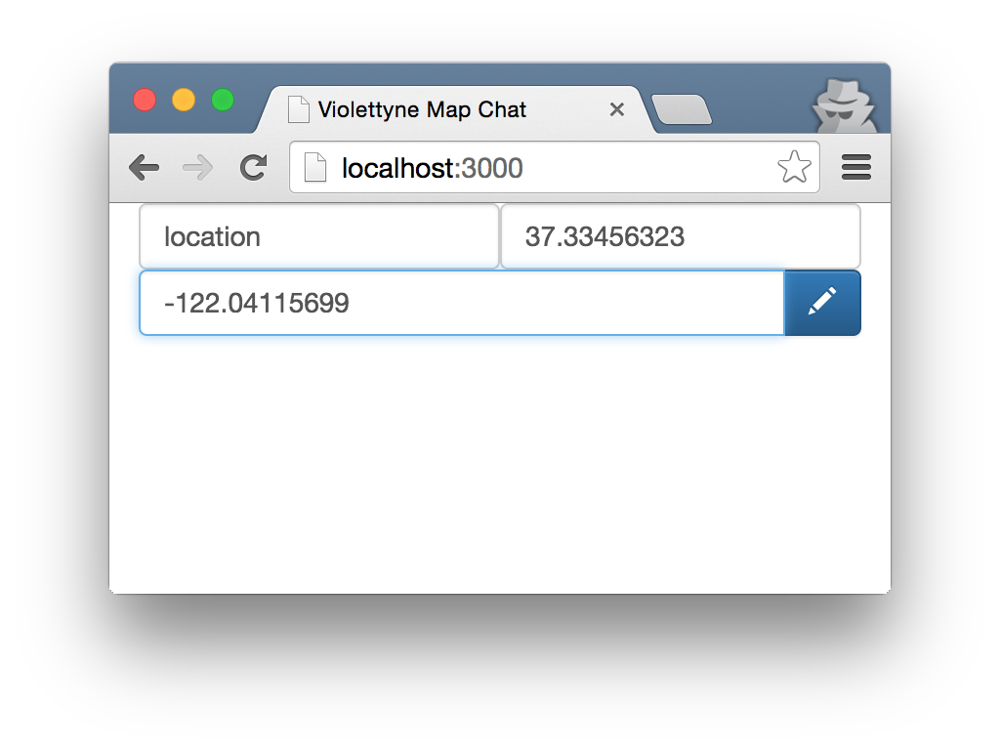

Prerequisites
--
- Install Vagrant.
- Get a Google Maps API key for iOS.


Clone
--

```
git clone https://github.com/ninotoshi/violettyne.git
```


Run the Server
--

```
cd violettyne/server ;# under the clone directory
vagrant box add --name ubuntu1504 https://cloud-images.ubuntu.com/vagrant/vivid/current/vivid-server-cloudimg-amd64-vagrant-disk1.box
```

Or use your favorite box by modifying "ubuntu1504" in `Vagrantfile`.
Then

```sh
vagrant up
vagrant ssh
```

Execute the following inside the virtual machine after `vagrant ssh`.
```
cd violettyne
i=0; while [ $i -lt 8 ]; do echo -n $RANDOM;  i=`expr $i + 1`; done > salt.txt
node index.js
```


Run the Client
--

```
violettyne/ios ;# under the clone directory
echo -n "Your Google Maps API Key" > violettyne/mapAPIKey.txt
open violettyne.xcworkspace
```

Run the application in Xcode.


Simulate a Neighbor
--
Because this is a chat application, there must be neighbors appearing on the map to chat with.

Access http://localhost:3000/ and input a latitude and a longitude like this.



If a green marker appears on the map, you can click it to start a chat.
